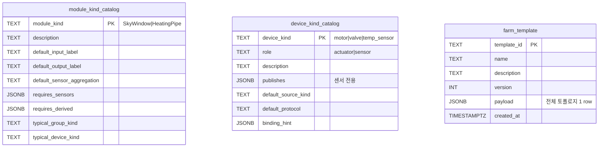
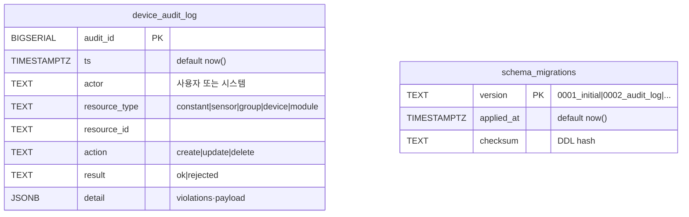
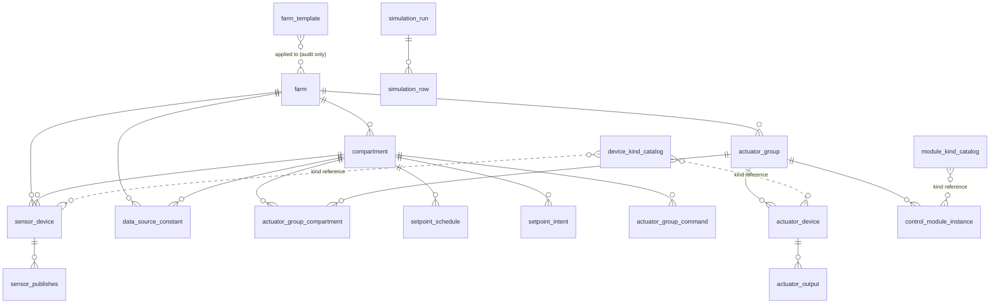

# DB Layer ERD

소스: `croftos/layers/db/{schema,device_schema,metrics_schema,simulation_schema,weather_schema}.py` 의 실제 DDL.

본 문서는 정본(read-only). 스키마 변경 시 DDL 먼저 수정하고 본 ERD를 동기화한다.

---

## 범례

- `PK`: Primary Key
- `FK`: Foreign Key
- `(soft)`: `deleted_at IS NULL` 필터링 대상
- `JSONB`: PostgreSQL JSONB
- `HT`: TimescaleDB hypertable (시간 partition)
- `(planned)`: DB1~DB2에서 신설 예정

---

## 1. Master 토폴로지 (장치 인벤토리)

운영 SSOT — `DeviceRepoPostgres`가 전부 여기서 읽음.

```mermaid
erDiagram
    farm ||--o{ compartment : "has"
    farm ||--o{ sensor_device : "FARM scope"
    farm ||--o{ data_source_constant : "FARM scope"
    farm ||--o{ actuator_group : "owns"

    compartment ||--o{ sensor_device : "COMPARTMENT scope"
    compartment ||--o{ data_source_constant : "COMPARTMENT scope"
    compartment ||--o{ actuator_group_compartment : "served by"

    actuator_group ||--o{ actuator_group_compartment : "covers"
    actuator_group ||--o{ actuator_device : "groups"
    actuator_group ||--o{ control_module_instance : "controlled by"

    sensor_device ||--o{ sensor_publishes : "emits LV"

    farm {
        TEXT farm_id PK
        TEXT name
        FLOAT latitude
        FLOAT longitude
        TEXT tz_name
        TIMESTAMPTZ created_at
    }
    compartment {
        TEXT compartment_id PK
        TEXT farm_id FK
        TEXT name
        TIMESTAMPTZ deleted_at "soft"
    }
    sensor_device {
        TEXT sensor_id PK
        TEXT scope "FARM|COMPARTMENT"
        TEXT farm_id FK
        TEXT compartment_id FK
        TEXT source_kind "MEASURED|CALCULATED|..."
        JSONB comm_binding
        TEXT template_origin
        TIMESTAMPTZ deleted_at "soft"
    }
    sensor_publishes {
        TEXT sensor_id PK_FK
        TEXT logical_variable PK
    }
    actuator_group {
        TEXT actuator_group_id PK
        TEXT farm_id FK
        TEXT kind "skywindow|heating_pipe"
        TEXT module_kind
        TIMESTAMPTZ deleted_at "soft"
    }
    actuator_group_compartment {
        TEXT actuator_group_id PK_FK
        TEXT compartment_id PK_FK
    }
    actuator_device {
        TEXT actuator_id PK
        TEXT actuator_group_id FK
        TEXT kind "motor|valve|pump"
        TEXT role "ROLE_BASED용"
        FLOAT distribution_weight "WEIGHTED용"
        JSONB comm_binding
        TIMESTAMPTZ deleted_at "soft"
    }
    control_module_instance {
        TEXT instance_id PK
        TEXT module_kind
        TEXT actuator_group_id FK
        TEXT input_label "AGGREGATED|PER_COMPARTMENT"
        TEXT output_label "UNIFORM|WEIGHTED|ROLE_BASED"
        TEXT sensor_aggregation "AVG|MAX|MIN"
        JSONB requires_sensors
        JSONB requires_derived
        BOOL enabled
        TIMESTAMPTZ deleted_at "soft"
    }
    data_source_constant {
        TEXT constant_id PK
        TEXT scope "FARM|COMPARTMENT"
        TEXT farm_id FK
        TEXT compartment_id FK
        TEXT logical_variable
        FLOAT value
        TEXT rationale "필수"
        TIMESTAMPTZ deleted_at "soft"
    }
```

**제약 요약:**
- `sensor_device.scope='FARM'` ⇒ `farm_id NOT NULL AND compartment_id IS NULL`
- `sensor_device.scope='COMPARTMENT'` ⇒ `compartment_id NOT NULL`
- `data_source_constant`: `(scope, farm_id, compartment_id, logical_variable)` UNIQUE
- `control_module_instance.input_label='AGGREGATED'` ⇔ `sensor_aggregation NOT NULL`

---

## 2. Setpoint Chain ([1]→[2]→[3]→[4])

`setpoint.md §하위 3` 흐름. 사용자 의도 → 그룹 명령 → 개별 출력.

```mermaid
erDiagram
    compartment ||--o{ setpoint_schedule : "has schedule per domain"
    compartment ||--o{ setpoint_intent : "active intent"
    compartment ||--o{ actuator_group_command : "[3] group cmd"
    actuator_device ||--o{ actuator_output : "[4] dispatched (FK ALTER)"

    setpoint_schedule {
        TEXT compartment_id PK_FK
        TEXT domain PK "ventilation_temp|..."
        INT stage_no PK
        TEXT condition
        INT relative_h
        INT relative_m
        FLOAT target_temp
        FLOAT insolation_adj
        FLOAT insolation_min
        FLOAT insolation_max
        FLOAT accum_insolation_adj
        FLOAT accum_min
        FLOAT accum_max
        FLOAT humidity_adj
        FLOAT humidity_min
        FLOAT humidity_max
        INT ramp_min
        TIMESTAMPTZ updated_at
    }
    setpoint_intent {
        TEXT compartment_id PK_FK
        TIMESTAMPTZ target_time PK
        TEXT variable PK
        FLOAT value
        INT priority PK
        TEXT source "user|recipe|..."
    }
    actuator_group_command {
        TEXT compartment_id PK_FK "NULL 허용"
        TEXT actuator_group_id PK
        TIMESTAMPTZ issued_at PK
        FLOAT value
        TEXT reason
    }
    actuator_output {
        TEXT actuator_id PK_FK "→ actuator_device"
        TIMESTAMPTZ issued_at PK
        FLOAT value
        TEXT source_command_id
    }
```

**현재 상태 ⚠**:
- `setpoint_intent`, `actuator_group_command` — DDL만 있고 INSERT 미구현 (Recipe 워커 도입 시점에 활성)
- `actuator_output` — DDL + FK ALTER 있는데 `actuator_manager.py`가 ring buffer만 사용 → **DB3에서 INSERT 활성**

---

## 3. Catalog & Template (시드/등록)

운영·시뮬·테스트 모두 DB에서 읽는다 (DB5 이후).



**메모:** `farm_template.payload`는 `{farm, compartments, sensors, groups, devices, modules, constants}` 통째 JSONB. `template_loader.py`가 적용 시 transactional INSERT.

---

## 4. Time-series (Hypertable)

```mermaid
erDiagram
    core_metric_ts {
        TIMESTAMPTZ ts PK_HT
        TEXT layer "L1|L2|L4|L7"
        TEXT metric "host.cpu_pct|http.latency_ms"
        FLOAT value
        JSONB labels
        TEXT event_id
        TEXT commit_hash "default dev-local"
    }
    weather_observation {
        TIMESTAMPTZ time PK_HT
        TEXT station_id PK
        TEXT logical_variable PK
        FLOAT value
    }
    simulation_run ||--o{ simulation_row : "has rows"
    simulation_run {
        UUID run_id PK
        TIMESTAMPTZ started_at
        TIMESTAMPTZ finished_at
        TEXT status "running|done|failed"
        TEXT mode "A_historical"
        TEXT station_id
        TIMESTAMPTZ weather_start
        TIMESTAMPTZ weather_end
        JSONB params
        TEXT error_message
        INT row_count
    }
    simulation_row {
        UUID run_id PK_FK
        TIMESTAMPTZ bucket_time PK_HT
        FLOAT setpoint
        FLOAT setpoint_base
        FLOAT accum_radiation_j
        JSONB sensor_values
        JSONB group_commands
        JSONB actuator_outputs
        FLOAT crop_dry_matter_kg_m2
        FLOAT crop_lai
    }
```

**Hypertable 컬럼:**
- `core_metric_ts(ts)` — L1/L2/L4/L7 부하 메트릭
- `weather_observation(time)` — KMA + 향후 다른 source
- `simulation_row(bucket_time)` — sim 결과 1분 trace

---

## 5. Validation Views (R1·R3·R6·R7)

뷰는 `erDiagram`으로 표현 안 되므로 표로 정리.

| 뷰 | 정의 | 검증 규칙 |
|---|---|---|
| `v_published_lvs` | `sensor_publishes ∪ data_source_constant` (scope, scope_id, lv) | 누가 어떤 LV를 publish하는지 |
| `v_required_lvs` | `control_module_instance.requires_sensors/derived ⨯ actuator_group_compartment` | 어떤 모듈이 어떤 LV를 요구하는지 |
| `v_lv_gaps` | `v_required_lvs EXCEPT v_published_lvs` | **R1**: 필요한데 publish 안 됨 |
| `v_lv_conflicts` | `v_published_lvs GROUP BY ... HAVING COUNT(*) > 1` | **R3**: 같은 LV 다중 publisher |

**R6/R7 (프로토콜 검증)**은 뷰가 아닌 `validation.py`에서 어댑터 레지스트리 조회로 처리.

---

## 6. 신규 (DB1~DB2 Phase 산출물)



**인덱스 계획:**
```sql
CREATE INDEX device_audit_log_ts_idx ON device_audit_log (ts DESC);
CREATE INDEX device_audit_log_resource_idx ON device_audit_log (resource_type, resource_id);
```

**도태 대상:**
- `croftos/data/devices/audit_log.yaml` → `device_audit_log` 테이블
- `croftos/layers/device/audit_log.py` → `croftos/layers/db/audit_repo.py`로 이전 후 폐기

---

## 7. 종착지 — 전체 도메인 한눈에

DB1~DB7 완료 시점의 최종 그림 (관계만, 컬럼 생략).



비결합 테이블 (FK 없음 — 시간/카탈로그):
- `core_metric_ts` (HT) — 모든 레이어가 emit
- `weather_observation` (HT) — station_id 자유
- `device_audit_log` *(planned)* — 모든 CRUD 흔적
- `schema_migrations` *(planned)* — DDL 이력

---

## 8. 테이블 인벤토리 요약

| # | 테이블 | 도메인 | HT | Soft del | 상태 |
|---|--------|-------|----|----------|------|
| 1 | `farm` | Master | | | ✅ |
| 2 | `compartment` | Master | | ✓ | ✅ |
| 3 | `sensor_device` | Master | | ✓ | ✅ |
| 4 | `sensor_publishes` | Master | | | ✅ |
| 5 | `actuator_group` | Master | | ✓ | ✅ |
| 6 | `actuator_group_compartment` | Master | | | ✅ |
| 7 | `actuator_device` | Master | | ✓ | ✅ |
| 8 | `control_module_instance` | Master | | ✓ | ✅ |
| 9 | `data_source_constant` | Master | | ✓ | ✅ |
| 10 | `setpoint_schedule` | Setpoint | | | ✅ |
| 11 | `setpoint_intent` | Setpoint | | | ⏸ DDL only |
| 12 | `actuator_group_command` | Setpoint | | | ⏸ DDL only |
| 13 | `actuator_output` | Setpoint | | | ⚠ DB3에서 INSERT 활성 |
| 14 | `module_kind_catalog` | Catalog | | | ✅ |
| 15 | `device_kind_catalog` | Catalog | | | ✅ |
| 16 | `farm_template` | Catalog | | | ✅ |
| 17 | `core_metric_ts` | TS | ✓ | | ✅ |
| 18 | `weather_observation` | TS | ✓ | | ✅ |
| 19 | `simulation_run` | TS | | | ✅ |
| 20 | `simulation_row` | TS | ✓ | | ✅ |
| 21 | `device_audit_log` | Audit | | | 🆕 DB1 |
| 22 | `schema_migrations` | Meta | | | 🆕 DB1 |

**View (4):** `v_published_lvs`, `v_required_lvs`, `v_lv_gaps`, `v_lv_conflicts`

---

## 9. 동기화 규칙

이 ERD가 깨지지 않도록 다음을 지킨다.

1. **DDL 먼저, ERD 다음** — `*_schema.py` 수정 후 본 문서 해당 섹션 업데이트.
2. **PK/FK는 Mermaid 라벨에 명시** — `PK`, `FK`, `PK_FK` 표기 통일.
3. **컬럼 추가/삭제는 표로 충분** — Mermaid `erDiagram`은 모든 컬럼을 그리지 말고 *비즈니스 핵심 + 제약 컬럼*만.
4. **View는 Mermaid 미지원** — §5 표 형식 유지.
5. **Soft delete 컬럼**은 `"soft"` 코멘트 표기 — read 쿼리는 `WHERE deleted_at IS NULL` 필수.
