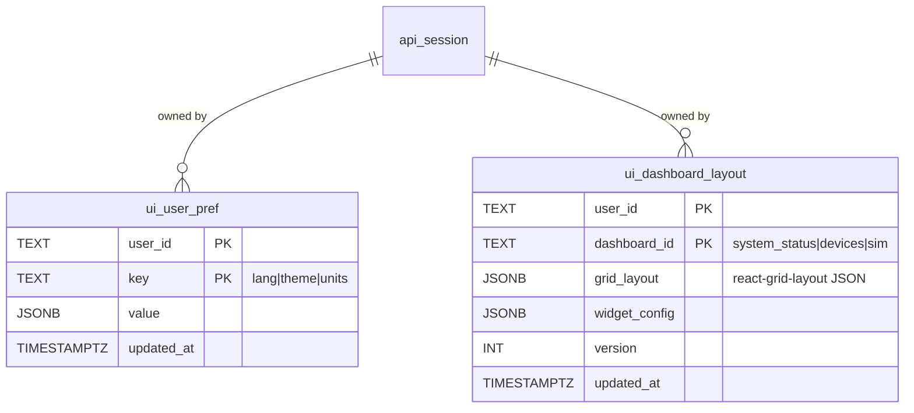
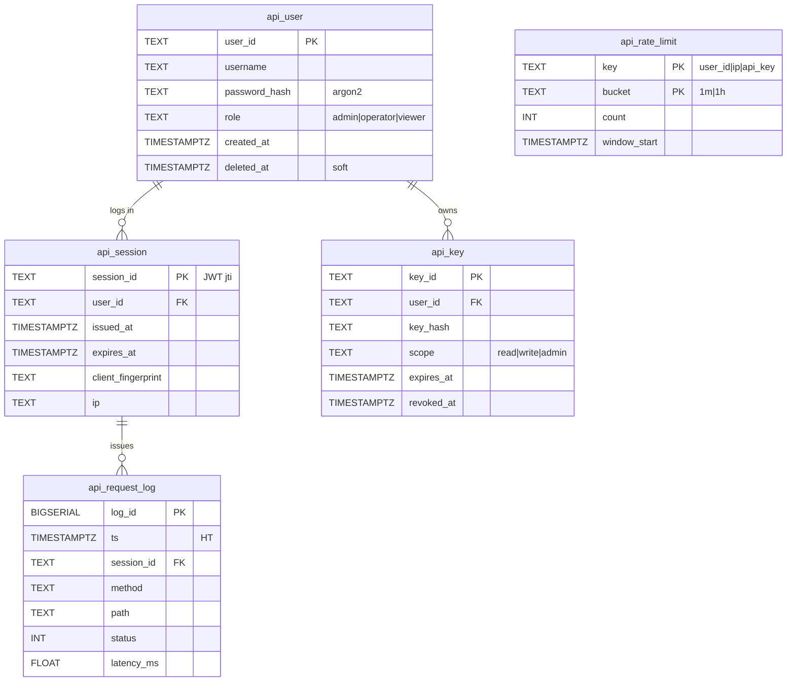
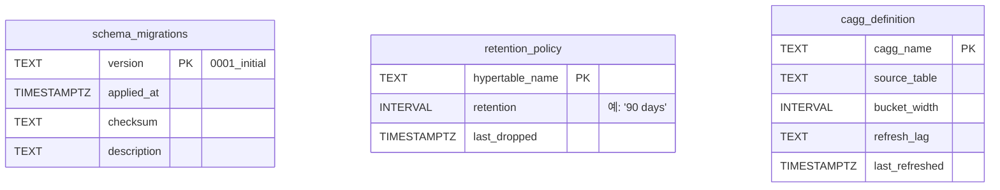
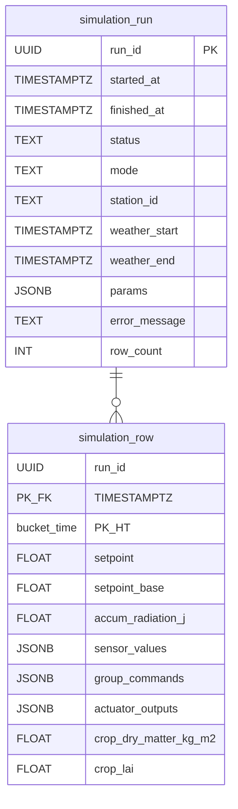

# 6-Layer 데이터 모델 ERD

본 문서는 Croft-OS **6-Layer 아키텍처 기준**으로 필요한 모든 데이터 엔티티를 정의한다.
*현재 DB에 존재하는 것 + 아직 없는 것* 모두 포함하며, 갭(gap)은 우선순위와 함께 기록한다.

---

## 본 문서의 책임

| 문서 | 관점 | 시점 |
|------|------|------|
| [db_layer_erd.md](db_layer_erd.md) | 현재 DB 스키마 정본 | 지금 |
| **본 문서 (erd_6layer.md)** | 6-Layer 완성형 데이터 모델 | 종착지 |
| [device_manager_concepts.md](device_manager_concepts.md) | Device Manager 개념 정의 | D1~D7 |

**규칙:**
- 본 문서가 *목표*를 정의한다. 새 엔티티 추가 결정은 여기서 먼저 굳히고 → 구현은 `*_schema.py` + `db_layer_erd.md` 동기화.
- ✅ 구현됨 / 🟡 부분 / ❌ 미구현 / 💭 토론 필요 표기.

---

## 1. Layer × 엔티티 매트릭스

각 레이어가 *소유*하거나 *주로 쓰는* 데이터 엔티티 매핑.

| Layer | 소유 엔티티 | 상태 |
|-------|-----------|------|
| **UI** | `ui_user_pref`, `ui_dashboard_layout` | ❌ 없음 — 현재 localStorage만 |
| **API** | `api_session`, `api_key`, `api_rate_limit` | ❌ 없음 — 현재 인증 없음 |
| **Control** | `control_module_instance`, `setpoint_schedule`, `setpoint_intent`, `actuator_group_command`, `recipe_stage_runtime` | 🟡 일부 |
| **Device** | `sensor_device`, `sensor_publishes`, `actuator_group`, `actuator_device`, `data_source_constant`, `actuator_output`, `sensor_value_l0~l3` | 🟡 마스터만 |
| **Communication** | `comm_adapter_config`, `comm_session_log` | ❌ 없음 — 어댑터 설정 인메모리 |
| **DB (메타)** | `schema_migrations`, `retention_policy`, `cagg_definition` | ❌ 없음 — 명시적 추적 부재 |
| **Core (수직)** | `farm`, `compartment`, `core_metric_ts`, `device_audit_log`, `problem_log`, `logical_variable` | 🟡 일부 |
| **Models (수직)** | `greenhouse_params`, `crop_params`, `calibration_run` | ❌ 없음 — 코드 dataclass |

---

## 2. UI Layer

사용자 화면 상태·선호도. 현재 모두 브라우저 localStorage — *DB로 옮길지 토론 필요*.

### 2.1 ERD



### 2.2 토론 지점 💭

- **Q-UI-1**: 단일 사용자 시스템에서 user_id가 의미 있나? `farm_id` + `device_fingerprint`만으로 충분?
- **Q-UI-2**: 차트 선택·필터 같은 *임시* 상태도 DB에 저장? (no — localStorage 유지가 옳음)
- **Q-UI-3**: 모바일/PC 별 레이아웃 분리?

---

## 3. API Layer

### 3.1 ERD



### 3.2 현재 상태

- ❌ 인증 없음 — 모든 엔드포인트 public
- 🟡 `api_request_log`는 `core_metric_ts(layer='L4', metric='http.latency_ms')`로 부분 대체 중
- ❌ rate limit 없음

### 3.3 토론 지점 💭

- **Q-API-1**: 단일 농장 사내 시스템에서 인증 도입 필요? (운영 보안 vs. 개발 속도)
- **Q-API-2**: `api_request_log` 별도 테이블 vs. `core_metric_ts` 흡수?
  - 권고: 흡수 — schema·인덱스 중복 회피. labels에 method/path 박음.
- **Q-API-3**: API key는 PLC↔서버 통신용으로 미래 필요. Phase는?

---

## 4. Control Layer

[1] User Intent → [2] Compartment Setpoint → [3] Group Command → [4] Individual Output

### 4.1 ERD

```mermaid
erDiagram
    compartment ||--o{ setpoint_schedule : "[1] user schedule"
    compartment ||--o{ setpoint_intent : "[1] active intent"
    compartment ||--o{ actuator_group_command : "[3] group cmd"
    actuator_group ||--o{ control_module_instance : "controlled by"
    control_module_instance ||--o{ control_module_runtime : "tick state"
    setpoint_schedule ||--o{ recipe_stage_runtime : "active stage trace"

    setpoint_schedule {
        TEXT compartment_id PK_FK
        TEXT domain PK
        INT stage_no PK
        TEXT condition
        INT relative_h
        INT relative_m
        FLOAT target_temp
        FLOAT insolation_adj
        FLOAT humidity_adj
        INT ramp_min
    }
    setpoint_intent {
        TEXT compartment_id PK_FK
        TIMESTAMPTZ target_time PK
        TEXT variable PK
        FLOAT value
        INT priority PK
        TEXT source
    }
    control_module_instance {
        TEXT instance_id PK
        TEXT module_kind
        TEXT actuator_group_id FK
        TEXT input_label
        TEXT output_label
        JSONB requires_sensors
        JSONB requires_derived
        BOOL enabled
    }
    control_module_runtime {
        TEXT instance_id PK_FK
        TIMESTAMPTZ ts PK_HT
        FLOAT last_input
        FLOAT last_output
        TEXT state "ok|stale_sensor|disabled"
        JSONB internal_state "PID error sum 등"
    }
    recipe_stage_runtime {
        TEXT compartment_id PK
        TEXT domain PK
        TIMESTAMPTZ when PK_HT
        INT active_stage_no
        FLOAT base_temp
        FLOAT delta_insolation
        FLOAT delta_accum
        FLOAT delta_humidity
        FLOAT setpoint
    }
    actuator_group_command {
        TEXT compartment_id FK
        TEXT actuator_group_id PK
        TIMESTAMPTZ issued_at PK_HT
        FLOAT value
        TEXT reason
    }
```

### 4.2 현재 상태

- ✅ `setpoint_schedule` — `recipe.md` 정본 흐름
- 🟡 `setpoint_intent` — DDL 있음, INSERT 미구현
- 🟡 `actuator_group_command` — DDL 있음, INSERT 미구현
- ✅ `control_module_instance` — Device Manager D2~D7
- ❌ `control_module_runtime` — 모듈별 1분 tick 상태 영속화 없음 (현재 cache only)
- ❌ `recipe_stage_runtime` — 매분 활성 stage trace 영속화 없음 (UI 차트가 매번 재계산)

### 4.3 갭 분석

| 갭 | 영향 | 우선순위 |
|----|------|---------|
| `control_module_runtime` | PID error sum 같은 내부 상태 재시작 시 손실 | 🟠 PID 도입 후 |
| `recipe_stage_runtime` | UI에서 활성 stage 변경 이력 못 봄 + 곡선 매번 재계산 | 🟡 UI 요구 시 |
| `actuator_group_command` INSERT | [3]→[4] 추적 불가, postmortem 어려움 | 🔴 DB3과 함께 |

### 4.4 토론 지점 💭

- **Q-CTRL-1**: `control_module_runtime`을 hypertable로 만들지, 또는 이미 있는 `core_metric_ts`에 `layer='control'`로 흡수? (권고: 흡수)
- **Q-CTRL-2**: `recipe_stage_runtime`의 PK가 `(compartment, domain, when)` — when은 분 단위 정렬? (권고: 1분 bucket)

---

## 5. Device Layer

### 5.1 ERD — 마스터 + 시계열

```mermaid
erDiagram
    sensor_device ||--o{ sensor_publishes : ""
    sensor_device ||--o{ sensor_value_l0 : "raw"
    sensor_value_l0 }o--|| sensor_value_l1_1m : "1m CAGG"
    sensor_value_l1_1m }o--|| sensor_value_l2_5m : "5m CAGG"
    sensor_value_l2_5m }o--|| sensor_value_l3_daily : "daily CAGG"

    actuator_group ||--o{ actuator_device : ""
    actuator_device ||--o{ actuator_output : "[4] dispatched"

    sensor_device {
        TEXT sensor_id PK
        TEXT scope
        TEXT farm_id FK
        TEXT compartment_id FK
        TEXT source_kind
        JSONB comm_binding
    }
    sensor_publishes {
        TEXT sensor_id PK_FK
        TEXT logical_variable PK
    }
    sensor_value_l0 {
        TEXT sensor_id PK_FK
        TEXT logical_variable PK
        TIMESTAMPTZ ts PK_HT "raw 1초"
        FLOAT value
        TEXT quality "ok|stale|invalid"
    }
    sensor_value_l1_1m {
        TEXT sensor_id PK_FK
        TEXT logical_variable PK
        TIMESTAMPTZ bucket PK_HT
        FLOAT avg
        FLOAT min
        FLOAT max
        INT sample_count
    }
    sensor_value_l2_5m {
        TEXT sensor_id PK_FK
        TEXT logical_variable PK
        TIMESTAMPTZ bucket PK_HT
        FLOAT avg
        FLOAT min
        FLOAT max
    }
    sensor_value_l3_daily {
        TEXT sensor_id PK_FK
        TEXT logical_variable PK
        DATE bucket PK
        FLOAT avg
        FLOAT min
        FLOAT max
        FLOAT sum_pos "광량 적산 등"
    }
    actuator_device {
        TEXT actuator_id PK
        TEXT actuator_group_id FK
        TEXT kind
        TEXT role
        FLOAT distribution_weight
        JSONB comm_binding
    }
    actuator_output {
        TEXT actuator_id PK_FK
        TIMESTAMPTZ issued_at PK_HT
        FLOAT value
        TEXT source_command_id
    }
```

### 5.2 현재 상태 — 가장 큰 갭

- ✅ Master (sensor/actuator/group/module/constant/catalog)
- 🟡 `actuator_output` — DB3에서 INSERT 활성 예정
- ❌ **`sensor_value_l0~l3` 4단계 시계열 전혀 없음** — `sensor.md`의 핵심 정본인데 DB 미구현
  - 현재: `state.cache.sensor_values`에 *현재값*만 존재
  - 부재: raw·1m·5m·daily 시계열 적재 + Continuous Aggregate

### 5.3 갭 분석 — Sensor 시계열은 본 시스템의 심장

| 갭 | 영향 | 우선순위 |
|----|------|---------|
| `sensor_value_l0` (raw) | 센서 데이터 영속화 자체 없음 — 재시작 시 모든 기록 손실 | 🔴 최우선 |
| `sensor_value_l1_1m` (1m CAGG) | 차트가 raw에서 매번 집계 — 부하 폭증 | 🔴 |
| `sensor_value_l2_5m`, `l3_daily` | 장기 트렌드 조회 불가 | 🟠 |
| `actuator_output` INSERT | postmortem 불가 | 🔴 DB3 |

### 5.4 토론 지점 💭

- **Q-DEV-1**: `sensor_value_l0` PK가 `(sensor_id, lv, ts)` — 한 센서가 같은 LV를 publish할 수 있나? (권고: yes — 다중 채널 가능)
- **Q-DEV-2**: TimescaleDB Continuous Aggregate 자동 갱신 vs. 수동 cron? (권고: CAGG + refresh_continuous_aggregate)
- **Q-DEV-3**: `quality` 컬럼 enum vs. JSONB(상세)?

---

## 6. Communication Layer

어댑터 설정·세션·통신 로그.

### 6.1 ERD

```mermaid
erDiagram
    comm_adapter_config ||--o{ comm_session_log : "boots"
    comm_adapter_config ||--o{ comm_io_log : "I/O"

    comm_adapter_config {
        TEXT adapter_id PK
        TEXT protocol "modbus_tcp|rs485|simulator"
        JSONB connection "host|port|baud|..."
        BOOL enabled
        TIMESTAMPTZ created_at
        TIMESTAMPTZ deleted_at "soft"
    }
    comm_session_log {
        BIGSERIAL session_id PK
        TEXT adapter_id FK
        TIMESTAMPTZ started_at
        TIMESTAMPTZ ended_at
        TEXT result "ok|failed|disconnected"
        TEXT error_message
    }
    comm_io_log {
        TEXT adapter_id FK
        TIMESTAMPTZ ts PK_HT
        TEXT direction "tx|rx"
        TEXT actuator_id "장치 식별"
        BYTEA frame_raw "디버그용"
        FLOAT latency_ms
        TEXT result "ok|timeout|crc_error"
    }
```

### 6.2 현재 상태

- ❌ `comm_adapter_config` — 현재 코드 hardcode (`SimulatorNoopAdapter`)
- ❌ `comm_session_log` — 어댑터 부팅 흔적 없음
- ❌ `comm_io_log` — Modbus·RS485 도입 전 deferred

### 6.3 토론 지점 💭

- **Q-COMM-1**: `comm_io_log`는 hypertable로 모든 프레임 저장? 부하 큼 — `core_metric_ts`로 흡수하고 *에러만 별도 테이블*?
  - 권고: 평시 `core_metric_ts`, 에러 발생 시 `comm_error_log`에 frame_raw 포함
- **Q-COMM-2**: `comm_adapter_config.connection`이 JSONB — 어떤 protocol이든 자유. validate는 어댑터 등록 시 schema 검사.
- **Q-COMM-3**: PLC 시뮬레이터 부팅 시 자동 등록 vs. 운영 UI에서 수동 등록?

---

## 7. DB Layer (메타)

DB 자체 운영 메타 — schema 진화·retention·CAGG.

### 7.1 ERD



### 7.2 토론 지점 💭

- **Q-META-1**: alembic 도입? (DB8) 또는 자체 `schema_migrations` 테이블 + 순서 보장 loader로 충분?
  - 권고: 후자가 가벼움. 운영 schema 진화가 잦아지면 alembic.
- **Q-META-2**: TimescaleDB의 `add_retention_policy()`로 자동 처리? 또는 명시 테이블로 추적?
  - 권고: TimescaleDB 함수 사용 + `retention_policy` 테이블은 *문서화·감사*용.

---

## 8. Core (수직 관통)

모든 레이어가 import하는 공통 데이터.

### 8.1 ERD

```mermaid
erDiagram
    farm ||--o{ compartment : ""
    farm ||--o{ logical_variable_scope : ""
    compartment ||--o{ logical_variable_scope : ""
    logical_variable ||--o{ logical_variable_scope : "instantiated in"

    farm {
        TEXT farm_id PK
        TEXT name
        FLOAT latitude
        FLOAT longitude
        TEXT tz_name
    }
    compartment {
        TEXT compartment_id PK
        TEXT farm_id FK
        TEXT name
        TIMESTAMPTZ deleted_at "soft"
    }
    logical_variable {
        TEXT lv_code PK "TEMP_AIR|RADIATION_OUTSIDE|..."
        TEXT category "environment|light|setpoint|actuator|crop"
        TEXT section_ref "sensor.md §5-1"
        TEXT unit
        TEXT description
        FLOAT default_min
        FLOAT default_max
    }
    logical_variable_scope {
        TEXT lv_code PK_FK
        TEXT scope PK "FARM|COMPARTMENT"
        TEXT scope_id PK
        BOOL is_required "control 모듈 의존 여부"
    }
    core_metric_ts {
        TIMESTAMPTZ ts PK_HT
        TEXT layer "L1|L2|L4|L7"
        TEXT metric
        FLOAT value
        JSONB labels
        TEXT event_id
        TEXT commit_hash
    }
    device_audit_log {
        BIGSERIAL audit_id PK
        TIMESTAMPTZ ts
        TEXT actor
        TEXT resource_type
        TEXT resource_id
        TEXT action
        TEXT result
        JSONB detail
    }
    problem_log {
        TEXT event_id PK
        TIMESTAMPTZ raised_at
        TIMESTAMPTZ resolved_at
        TEXT layer
        TEXT severity "INFO|WARNING|ERROR|CRITICAL"
        TEXT code
        TEXT message
        JSONB context
    }
    weather_observation {
        TIMESTAMPTZ time PK_HT
        TEXT station_id PK
        TEXT logical_variable PK
        FLOAT value
    }
```

### 8.2 현재 상태

- ✅ `farm`, `compartment`
- ❌ **`logical_variable` 카탈로그가 DB에 없음** — 코드 enum (`croftos/core/logical_variable.py`)이 SSOT
- ✅ `core_metric_ts`
- ✅ `weather_observation`
- 🆕 `device_audit_log` — DB1
- ❌ **`problem_log`** — `Problem` 모델은 cache 인-메모리만, 영속화 없음

### 8.3 갭 분석

| 갭 | 영향 | 우선순위 |
|----|------|---------|
| `logical_variable` DB | 카탈로그 변경 시 코드 deploy 필수, 동적 추가 불가 | 🟡 (LV가 안정적이라 낮음) |
| `problem_log` | 시스템 에러 이력 재시작 시 손실 → 진단 불가 | 🔴 (운영 신뢰성 핵심) |

### 8.4 토론 지점 💭

- **Q-CORE-1**: `logical_variable`을 DB로 옮기면 enum과 sync 비용. 권고: **유지** — LV는 코드 SSOT, 문서로 충분. Validation은 코드 enum 기준.
- **Q-CORE-2**: `problem_log`를 hypertable로? — 빈도 낮으니 일반 테이블이 충분, 인덱스 `(ts DESC)`만.

---

## 9. Models (수직)

`croftos/models/{greenhouse,crop,weather}` — 현재 코드 dataclass.

### 9.1 ERD

```mermaid
erDiagram
    farm ||--o{ greenhouse_params : ""
    compartment ||--o{ greenhouse_params : ""
    compartment ||--o{ crop_params : ""
    crop_params ||--o{ calibration_run : "tuned via"

    greenhouse_params {
        TEXT compartment_id PK_FK
        FLOAT volume_m3
        FLOAT cover_area_m2
        FLOAT floor_area_m2
        FLOAT cover_transmissivity
        FLOAT cover_u_value
        FLOAT floor_capacity
        TIMESTAMPTZ updated_at
        TEXT source "default|calibrated"
    }
    crop_params {
        TEXT compartment_id PK_FK
        TEXT crop_kind PK "tomato|cucumber"
        DATE planted_at
        FLOAT lue_g_per_j
        FLOAT q10
        FLOAT lai_per_dm
        TIMESTAMPTZ updated_at
        TEXT source "literature|calibrated"
    }
    calibration_run {
        UUID calib_id PK
        TEXT compartment_id FK
        TEXT target_param "lue|q10|cover_u"
        FLOAT before_value
        FLOAT after_value
        FLOAT rmse
        TIMESTAMPTZ run_at
        JSONB dataset_ref "weather range·sensor data"
    }
```

### 9.2 현재 상태

- ❌ 모두 코드 dataclass — 농가별 calibration 불가
- 운영에서 농장마다 다른 파라미터 → DB로 옮겨야 함

### 9.3 토론 지점 💭

- **Q-MODEL-1**: 다중 작물 지원? (`crop_params` PK에 `crop_kind` 포함됨)
- **Q-MODEL-2**: calibration 히스토리 보존? (권고: `calibration_run` 추가)
- **Q-MODEL-3**: 시뮬 vs 운영 파라미터 같은 테이블? (권고: 동일 — 시뮬도 같은 농장 인스턴스)

---

## 10. Simulation (시뮬 결과 — 별도 namespace)

운영과 격리되는 시뮬 출력. 현재 ✅.



**상태:** ✅ 그대로 유지. Phase 12 (RL)에서 `simulation_episode`, `simulation_reward` 추가 검토.

---

## 11. 갭 우선순위 종합

전체 종착지 vs 현재 차이를 *영향도* 기준으로.

### 🔴 P1 — 운영 데이터 누락 (즉시)

| # | 엔티티 | 이유 |
|---|--------|------|
| 1 | `sensor_value_l0~l3` | **센서 데이터 영속화 자체 없음** |
| 2 | `actuator_output` INSERT | postmortem·감사 불가 |
| 3 | `device_audit_log` | YAML 파일 의존 (DB1) |
| 4 | `problem_log` | 시스템 에러 이력 손실 |

### 🟠 P2 — 운영 신뢰성

| # | 엔티티 | 이유 |
|---|--------|------|
| 5 | `actuator_group_command` INSERT | [3]→[4] 추적 |
| 6 | `setpoint_intent` INSERT | [1]→[2] 추적 |
| 7 | `comm_session_log` | 어댑터 disconnect 진단 |
| 8 | `greenhouse_params`, `crop_params` | 농가별 calibration |

### 🟡 P3 — 기능 확장 시

| # | 엔티티 | 이유 |
|---|--------|------|
| 9 | `api_user`, `api_session` | 인증 도입 시 |
| 10 | `ui_dashboard_layout` | 멀티 사용자 시 |
| 11 | `control_module_runtime` | PID·MPC 도입 시 |
| 12 | `recipe_stage_runtime` | UI에서 stage 이력 보기 |
| 13 | `calibration_run` | 모델 보정 작업 시 |

### 💭 토론 후 결정

| # | 항목 | Q |
|---|------|---|
| 14 | `logical_variable` DB | 코드 enum 유지 vs DB 동기화 |
| 15 | `comm_io_log` hypertable | 모든 프레임 vs 에러만 |
| 16 | schema 마이그 | alembic vs 자체 테이블 |

---

## 12. db_layer.md plan과의 매핑

[db_layer.md] (작성 예정) 의 Phase가 본 ERD의 어떤 갭을 메우는지.

| Phase | 본 ERD 갭 |
|-------|----------|
| DB1 | `device_audit_log`, `schema_migrations`, fail-fast |
| DB2 | `device_audit_log` 활성 (audit YAML 폐기) |
| DB3 | `actuator_output` INSERT 활성 |
| DB4 | (인프라 — pytest schema fixture) |
| DB5 | catalog DB read (`module_kind_catalog`, `device_kind_catalog`, `farm_template`) |
| DB6 | DeviceRepoYaml 폐기 |
| DB7 | YAML 파일 정리 |
| DB8 | `schema_migrations` 정식화 (alembic) |

**본 ERD의 P1·P2 중 plan이 다루지 않는 부분:**
- `sensor_value_l0~l3` — **별도 큰 phase 필요** (Sensor Time-series Phase)
- `problem_log` — DB2와 함께 또는 별도 작은 phase
- `greenhouse_params`, `crop_params` — Models DB 이전 phase
- `comm_*` — Modbus 도입 phase에서

→ db_layer.md plan은 **YAML 도태**가 핵심이고, **센서 시계열·Models·Communication**은 별도 plan 필요.

---

## 13. 다음 단계

1. ✅ 본 문서로 6-Layer 데이터 모델 합의
2. 의사결정 (§2~§9의 💭 질문 답변)
3. db_layer.md plan 정본 확정 (Phase DB1~DB8)
4. **별도 plan 신설 검토:**
   - `sensor_timeseries.md` — `sensor_value_l0~l3` + CAGG
   - `models_db.md` — `greenhouse_params`, `crop_params`, `calibration_run`
   - `auth.md` — `api_user`, `api_session`, `api_key` (deferred)

---

## 14. 동기화 규칙

본 문서는 *목표 데이터 모델*이다. 실제 구현은 다음 동기화를 따른다.

1. 새 엔티티 합의 → 본 문서에 추가 (✅ → ❌ 표기)
2. DDL 작성 → `croftos/layers/db/*_schema.py`
3. `db_layer_erd.md` (현재 정본) 업데이트
4. 본 문서의 `❌` → `✅`로 변경

**역방향 금지:** 코드를 먼저 짜고 본 문서를 사후 맞추는 것은 정본 무력화. 토론 → 합의 → 본 문서 → 코드.
